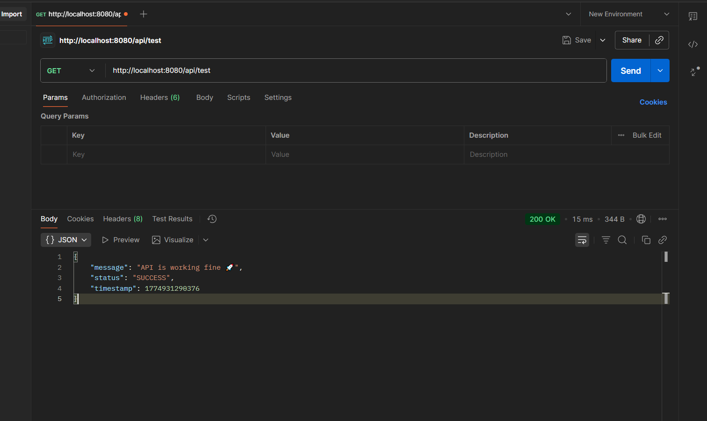
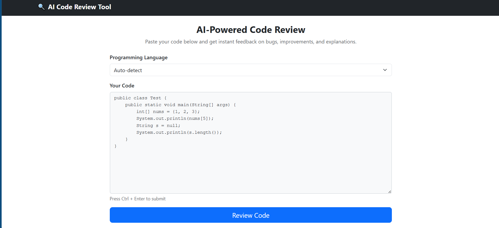
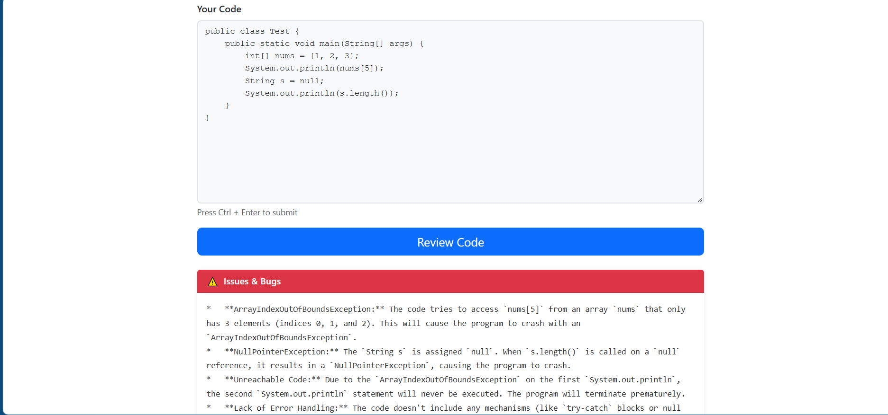
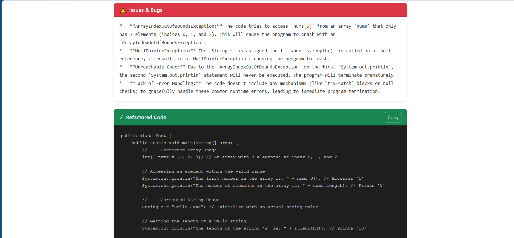
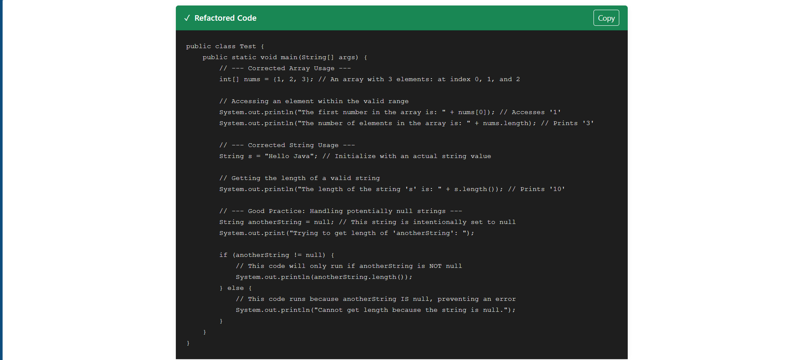
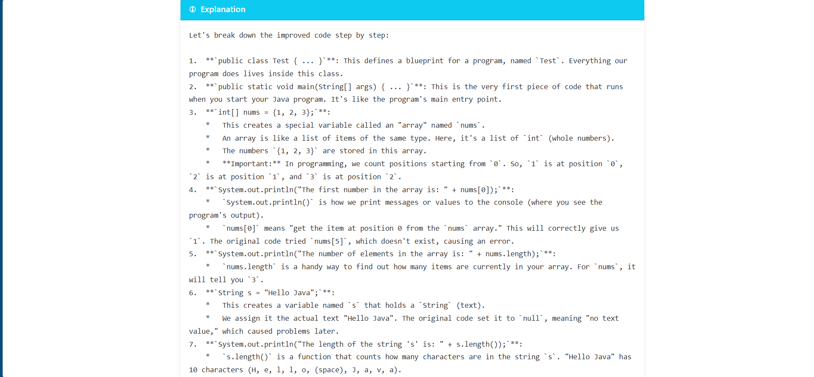

# 🚀 AI Code Review Tool

An **AI-powered code review web application** that analyzes your code, detects bugs, suggests improvements, and explains everything in **simple human-readable language**.

This project helps developers:
- Identify errors quickly ⚡  
- Improve code quality 📈  
- Understand code better 🧠  

---

## ✨ Features

- 🔍 Detects **bugs & issues** in code
- ♻️ Provides **refactored version**
- 📖 Explains code in **simple English**
- 🌐 Clean and minimal **web UI**
- ⚡ Fast response using **Google Gemini API**

---

## 🛠️ Tech Stack

### 🔹 Frontend
- React.js (Single Page Application)
- Axios (API calls)
- Simple clean UI (no heavy frameworks)

### 🔹 Backend
- Java Spring Boot
- REST APIs
- Maven Project
- WebClient / RestTemplate (API integration)

### 🔹 AI Integration
- Google Gemini API  
  - **Input:** Code snippet (String)  
  - **Output:**  
    - Issues in code  
    - Refactored code  
    - Explanation in simple English  

---

## 📸 Screenshots

### 🔹 API Test (Spring Boot)

---

### 🔹 Main UI - Code Input

---

### 🔹 Issues & Bugs Output

---

### 🔹 Refactored Code

---

### 🔹 Explanation Section

---

## ⚙️ How It Works

1. User enters code in the UI  
2. React frontend sends request to backend API  
3. Spring Boot calls Gemini API  
4. Gemini processes and returns:
   - Issues
   - Refactored code
   - Explanation  
5. Results are displayed on UI  
